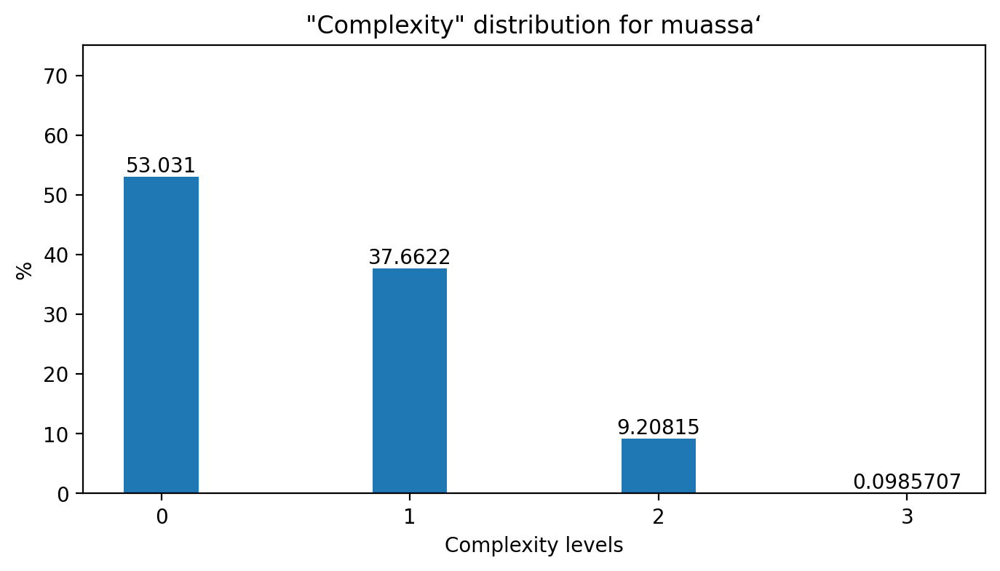
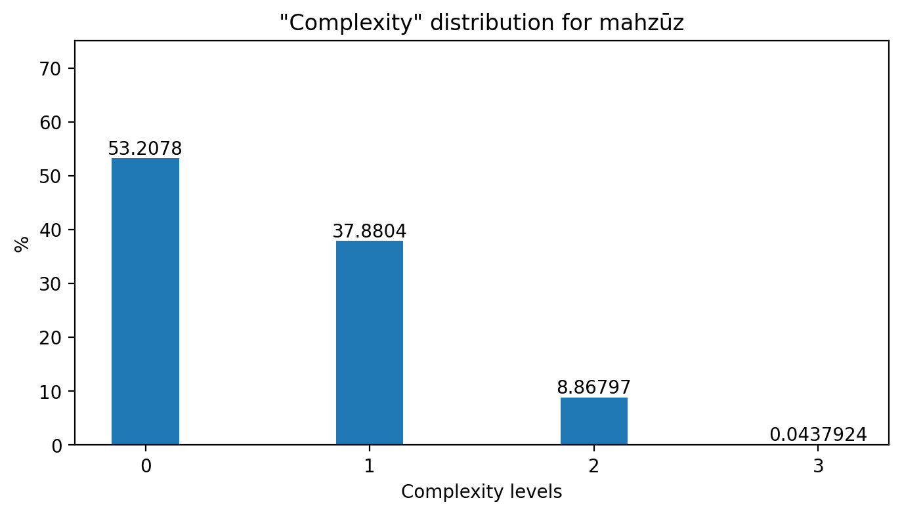
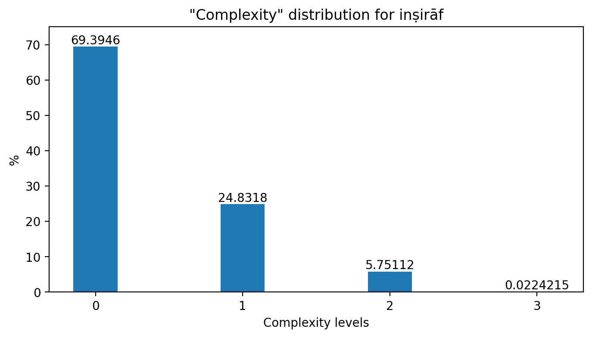

# A Study of the Rhythmic Complexity of the Different Tempo Ranges of Arab-Andalusian Music

This research project explores the rhythmic complexities present in Arab-Andalusian music and how they vary across different tempo ranges. The project proposes a measure of complexity and applies it to a dataset of annotated scores to identify the differences in the distribution of rhythm complexity between the different forms of the _nawba_ (classical Arab-Andalusian composition).

## Tempo Ranges
The _nawba_ typically includes three main tempo ranges, performed in order of increasing tempo: _muassa‘_ (slow), _mahzūz_ (medium), and _inṣirāf_ (fast).

## Dataset
The dataset used for this task is the [Arab-Andalusian Music](https://github.com/MTG/arab-andalusian-music) dataset from [Music Technology Group](https://www.upf.edu/web/mtg) in Barcelona. It contains 158 nawba scores in .xml format, including metadata for the nawbas, lyrics, and information about the sections that compose each of the scores. For this paper, five of these scores were analyzed.

## Methodology
To compare the complexity of the compositions targeting each of the tempo ranges, a "complexity" measure is proposed. To measure this complexity of each of the tempo ranges, the Python library [music21](http://web.mit.edu/music21) was used. From the annotated scores, only the _muassa‘_, _mahzūz_, and _inṣirāf_ sections were taken, and all notes contained in them were analyzed.

Considering the time signature of each of the sections (and changes in time signature inside the same section), three "complexity" levels were established:
- Level 0: notes starting on the beat.
- Level 1: notes starting any amount of 8th note positions after the beat.
- Level 2: notes starting on a 16th note position.
- Level 3: notes starting on a 32nd note position or 16th note triplets.

The number of occurrences of each of the complexity levels for all the analyzed scores are noted and compared to the total number of notes as a percentage.

## Results

For _muassa‘_ (results included on Figure 1 below), more than 50% of the notes were classified as a level 0 complexity, almost 40% of the notes fell on the level 1 and another 9% on level 2. The level 3 complexity (32nd note position or 16th note triplets) is negligible.

  

  <b>Figure 1.</b> Complexity distribution for the muassa‘ form.

For _mahzūz_ (results included on Figure 2 below), the results were surprisingly similar to muassa‘. 53% of the notes were classified as a level 0 complexity, 38% of the notes were classified as level 1 and 8.8% as level 2. Again, the level 3 complexity notes percentage is negligible.

  

  <b>Figure 2.</b> Complexity distribution for the mahzūz form.

For _inṣirāf_ the results for the complexity distribution (included on Figure 3 below) are much different. Almost 70% of the notes in this tempo range sections were on beat (level 0 complexity); only 25% of them fell on complexity level 1 and close to 6% of the notes were classified as level 2.

  

  <b>Figure 3.</b> Complexity distribution for the inṣirāf form.

## Usage
This repository provides a iPython Notebook that can be used to analyze and compare the complexity of Arab-Andalusian music compositions across different tempo ranges. The script requires the music21 library to be installed, as well as the AAM dataset in .xml format.

Once installed, run all the cells in the `RhythmComplexity_TempoRanges_Analysis.ipynb` file.

## Conclusion
This project provides insights into the rhythmic characteristics of Arab-Andalusian music and highlights the potential for further research using similar computational methods and tools. It was developed as part of the [Audio and Music Processing Lab](https://www.upf.edu/web/smc/audio-and-music-processing-lab) course in the [Master's in Sound and Music Computing](https://www.upf.edu/web/smc) at UPF in Barcelona.
